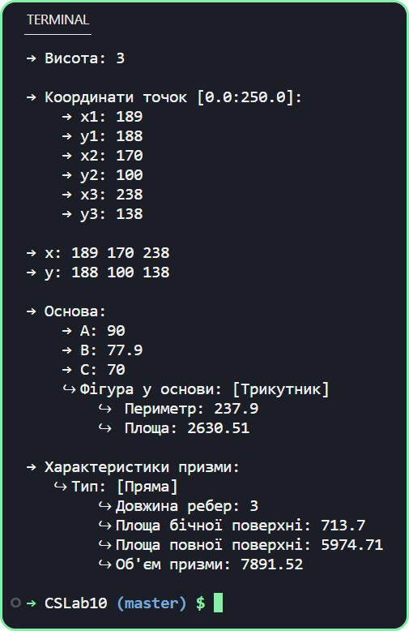

# Лабораторна робота 10
В даній лабораторній роботі реалізація функцій-елементів класу повинна бути написана в окремому модулі, а основну програму, що ілюструє застосування всіх методів вашого класу, варто реалізувати ще одним модулем. У всіх завданнях передбачите конструктори з аргументами за замовчуванням, а також дружню перевантажену операцію виведенян в потік і читання з потоку. Пам’ятайте, що можна використовувати константні функції get.*/

---

## 7. 
Створіть клас пряма призма, що зберігає тільки декартові координати вершин основи й висоту призми. Конструктор викликає набір функцій, які приймають групи координат і перевіряють, щоб кожна з координат х та у перебувала в першому квадранті в діапазоні від 0,0 до 250,0.*/

Повинні бути передбачені функції-елементи, що обчислюють довжину ребер, периметр і площа основи, а також площа бічної поверхні, площа поверхні й об’єм призми. Перевантажите операцію виведення в потік так, щоб вона друкувала, яка фігура лежить у основи, і її основні характеристики.

---

## Програма: [CSLab10](https://github.com/77696C6C69616D/CSLabs/blob/master/CSLab10/Program.cs)

---

## Результат:

---
