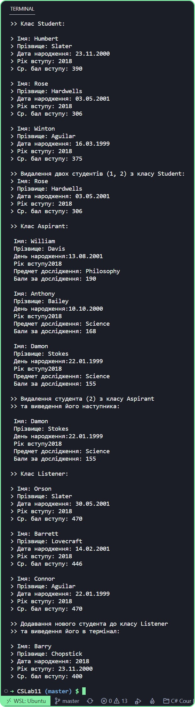

# Лабораторна робота 11

Створіть ієрархію класів + використовуючи спадкування. У кожному варіанті необхідно написати програму + що ілюструєзастосування всіх методів ваших класів. Перш ніж приступитидо написання програм + продумайте + які необхідні функції вкожному із класів (може + десь необхідно підрахувати координати +десь площі й об'єми + а десь зберігати прізвища й роки надходження):як у базовому + так й у класах-спадкування. Також продумайте + щоварто помістити в закриті (а + можливо + захищені) зміні. Продемонструйтеможливість перевизначення методів базового класу в похідному.

## Варіант 7. 
- Учень в університеті:
    - студент;
    - аспірант;
    - слухач.

---

## Програма: [CSLab11](https://github.com/77696C6C69616D/CSLabs/blob/master/CSLab11/Program.cs)
---
## Результат:

---
