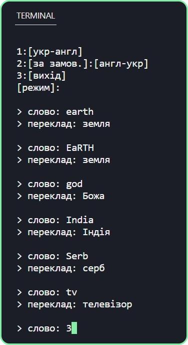
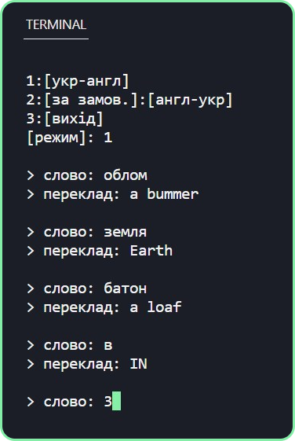
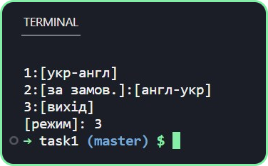
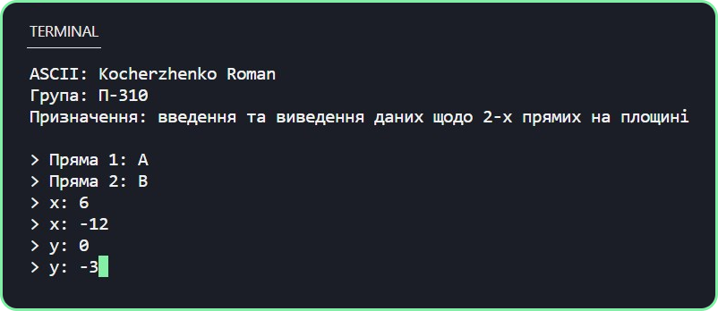
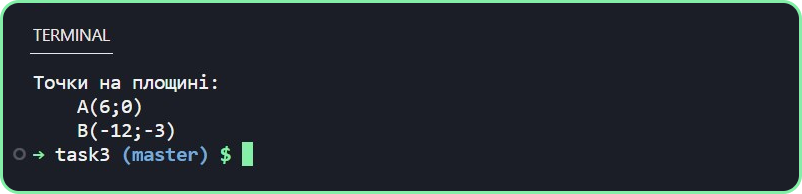

# Лабораторна робота №12

## Завдання 1. 
Створити примітивний словник, що містить пари слів - назв країн на двох мовах. Користувач повинен мати можливість вибирати напрямок перекладу і запитувати переклад (Для оцінки «4-5» ПРОПОНУЄМО СВІЙ ВАРІАНТ РЕАЛІЗАЦІЇ, МОЖНА WINDOWS FORMS).

## Завдання 2: 
Створити строго типізовану колекцію, яка приймає тільки значення певного типу (типізована колекція) (тип даних обираєте на ваш розсуд).     

---

## Програма: [CSLab12](https://github.com/77696C6C69616D/CSLabs/blob/master/CSLab12/task1/Program.cs)

---

## Результат:

---

## Завдання 3. 
Створити узагальнений клас прямої на площині. У класі передбачити 2 поля типу узагальненої точки, через які проходить пряма. 

---

- ## Реалізувати в класі:
    - конструктор, який приймає 2 точки
    - конструктор, які приймає 4 координати (х і у координати для 1-ої і 2-ої точки)
    - метод ToString () (в прикладі не має !!!)

- ## Вимоги до програми:
    - Вихідні дані повинні вводитися з клавіатури користувачем.
    - На екран повинні виводитися наступні дані: номер групи і ПІБ автора, призначення програми, результат роботи.
    - Клас повинен містити методи для введення-виведення та виконання операцій з даними.

---

## Програма: [CSLab12](https://github.com/77696C6C69616D/CSLabs/blob/master/CSLab12/task3/Program.cs)

---

## Результат:

---
