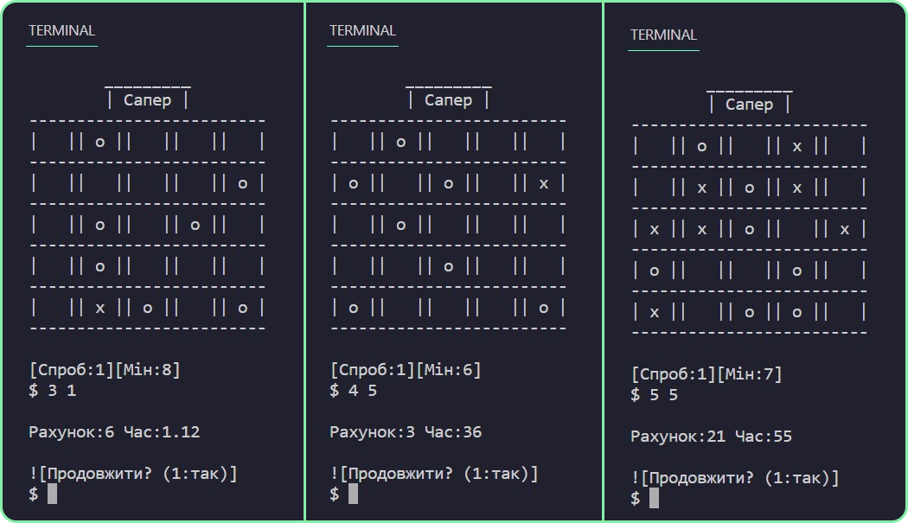
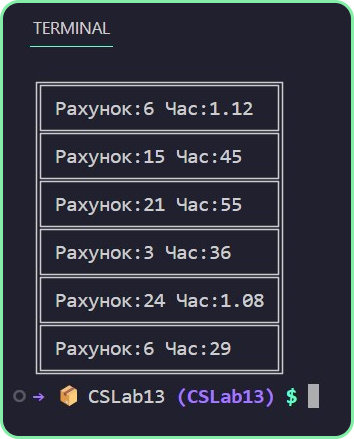
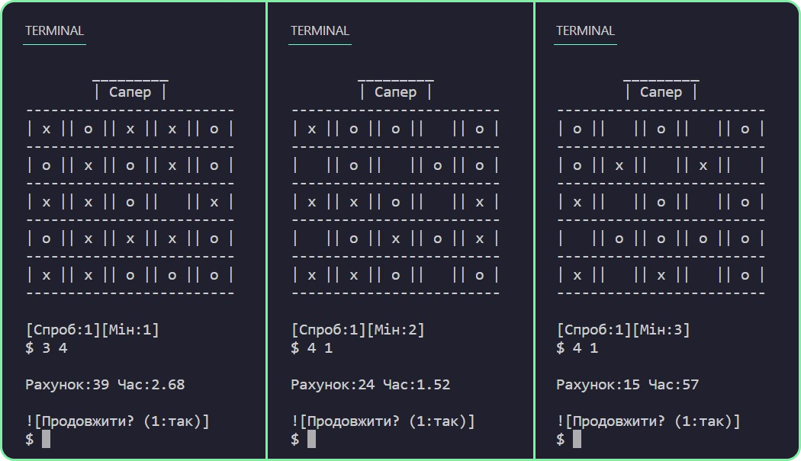
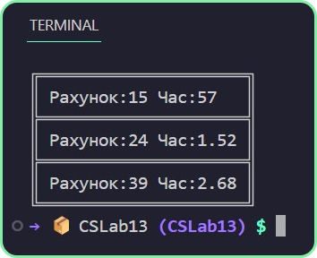

# Лабораторна робота 13
Написати гру Сапер. Задача гравця в цій грі є пошук всіх мін, 
які розміщенні по ігровому полю в випадковому порядку. 
Визначити в якій клітці знаходиться міна, можна за допомогою 
логічного мислення аналізуючи цифри, які розміщенні в деяких клітках.

---

1. Размер и форма поля (мин/макс? | квадрат/прямоугольник?)?
    - На свое усмотрение.
2. Пользователь выберает ячейку вводя имя в терминал (на подобии шахмотной доски) или наводя курсор? 
    - Желательно курсор
3. Какие конкретно елементы должны быть графикой? Достаточно ли сделать поле в виде той же шахмотной доски? 
    - Достаточно доски.
4. Нужно ли внедрять цепочку взрывов (когда при выборе одной ячейки, могут быть расскопаны ещё соседние (не мины))? 
    - Не нужно.
5. Таймер? Сложность? Результат? Таблица результатов? Количество оставшихся мин? Ограничения на флаги?
    - Достаточно таймера и таблицу результатов.

---

## p.s

- Програма не имеет графических елементов (библиотека OpenTK или встроенный Drawing)
из-за ограниченого количества времени и условий. 

- Всё графическое исполнение заключаеться только в выводе в консоль и 
использование метода Concat для работы со строками для динамического вывода

- Данная версия сапёра больше приближена к игре "Морской бой", мины не символизируют 
проигрыш, задача игрока найти мины раньше окончания свободных ходов.

- Єкран "победы" не был добавлен в связи со сложностю игры (в старых версиях её невозможно пройти)

---

## Програма: [CSLab13](https://github.com/77696C6C69616D/CSLabs/blob/master/CSLab13/Program.cs)

---

## Результат:

---
