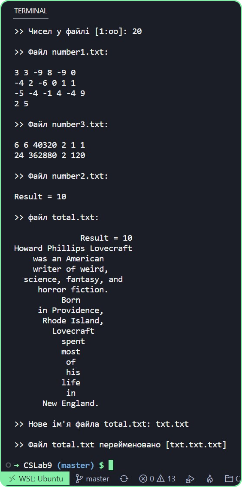
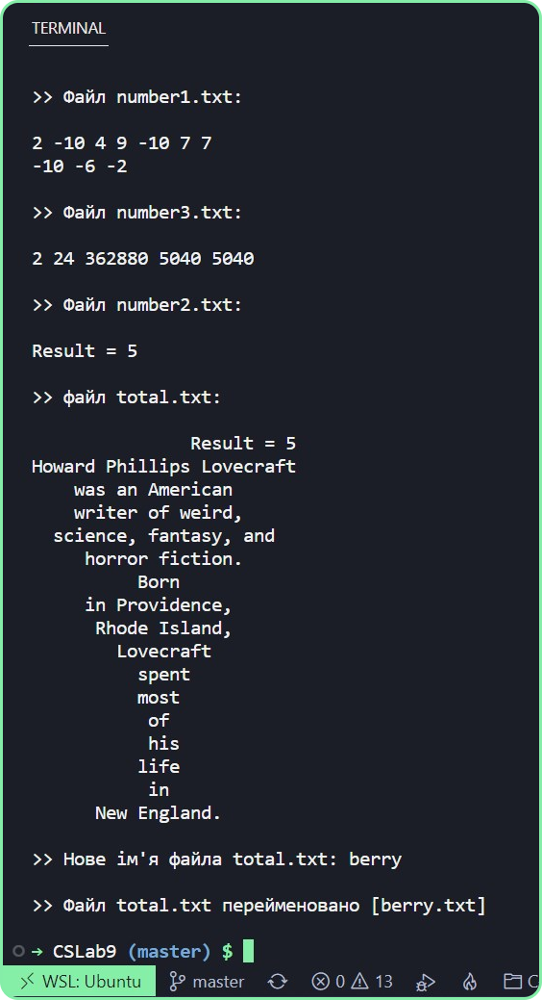

# Лабораторна робота 9

- За допомогою текстового редактора створити файл text1.txt і заповнити словами з латинських букв (не менш 30 слів).

- Файл number1.txt програмно заповнити випадковими цілими числами, що належать діапазону від -100 до 100. Кількість чисел у файлі задається із клавіатури. Кількість чисел у кожному рядку є довільним числом з діапазону від 0 до 10 і задається за допомогою функції rand(). Вивести числа на консоль, зберігши розбивку на рядки, що відповідає файлу number1.txt.

- При реалізації програми необхідно для заповнення файлу number1.txt випадковими цілими числами використати заголовний файл, що містить клас для заповнення файлу. При роботі з файлом, заповненим словами, можна використати функції роботи з рядками. При висновку результату у файл number3.txt зберегти розбивку на рядки.

- Записати у файл total.txt спочатку всі елементи файлу number2.txt, вирівняні по правому краї, а потім всі елементи файлу text2.txt,вирівняні по центрі. Перейменувати файл total.txt (нове ім'я файлу вводиться із клавіатури).

- Вивести на консоль спочатку всі елементи файлу number2.txt, вирівняні по правому краї, а потім всі елементи файлу text2.txt вирівняні по центрі.

---

### Варіант 7. 
- Підрахувати факторіал кожного позитивного елемента файлу number1.txt. Отримані елементи вивести у файл number3.txt і на консоль. У кінець файлу number2.txt додати слова "Result = " і число позитивних елементів, вивести отриманий результат на консоль. Видалити всі порожні рядки файлу text1.txt. Результат записати у файл text2.txt.

---

## Програма: [CSLab9](https://github.com/77696C6C69616D/CSLabs/blob/master/CSLab9/Program.cs)
---
## Результат:

---

---
